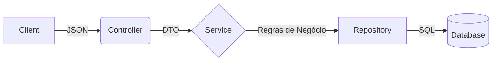

# ✂️ EncurtadorPro - URL Shortener


> Um sistema full-stack de encurtamento de URLs desenvolvido com arquitetura limpa, focado em performance e boas práticas de desenvolvimento.

## 🔗 Links do Projeto
- **Aplicação (Frontend):** [Link do seu Frontend no Render](https://encurtador-mutz.onrender.com)
- **API (Backend):** [Link do seu Backend no Render](https://api-encurtador.onrender.com)

---

## 🛠️ Tecnologias Utilizadas

### Backend (API)
- **Java 17 & Spring Boot 3**: Núcleo da aplicação.
- **Spring Data JPA**: Persistência de dados.
- **PostgreSQL**: Banco de dados relacional (Produção).
- **H2 Database**: Banco de dados em memória (Desenvolvimento).
- **Docker**: Containerização para deploy agnóstico.
- **Lombok**: Redução de boilerplate code.

### Frontend (Web)
- **React & TypeScript**: Interface reativa e tipada.
- **Vite**: Build tool de alta performance.
- **Tailwind CSS**: Estilização moderna e responsiva.
- **Lucide React**: Biblioteca de ícones leve.

---

## 🏗️ Arquitetura e Padrões
O projeto foi desenvolvido focando na separação de responsabilidades para evitar "Fat Controllers" e facilitar a testabilidade.

### Estrutura do Backend
- **Controller**: Responsável apenas por receber a requisição HTTP e devolver a resposta (DTOs). Não contém regras de negócio.
- **Service**: O "cérebro" da aplicação. Contém as regras de negócio (geração de hash, validação de URL, tratamento de colisão).
- **Repository**: Interface de comunicação direta com o Banco de Dados.
- **DTO (Data Transfer Object)**: Garante que a Entidade do banco nunca seja exposta diretamente na API.


### Rodando o Backend
```bash
# Clone o repositório
git clone https://github.com/NicolasDobbeck/encurtador-back.git
cd url-shortener

# Execute o projeto (O perfil 'dev' usa banco H2 em memória)
mvn spring-boot:run
```

### Rodando o FrontEnd
```bash
# Clone o repositório
git clone https://github.com/NicolasDobbeck/encurtador-front.git
cd encurtador-front

# Instale as dependências
npm install

# Rode o servidor de desenvolvimento
npm run dev
```
## 📝 Autor
Desenvolvido por Nicolas Dobbeck como projeto prático de Arquitetura de Software.
